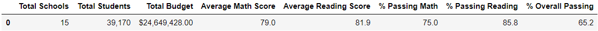
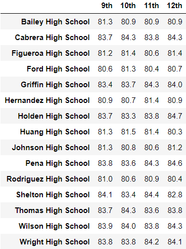

# School_District_Analysis
Analyze school district data and showcase trends in school performance.

## Overview of the school district analysis
The purpose of this analysis is to help the City School District Board to make strategic decisions regarding future school budgets and priorities based on test scores and current school funding. This analysis takes into consideration that the School Board has asked the Chief Data Scientist to replace the math and reading scores for Thomas High School ninth graders with NaNs while keeping the rest of the data intact. The outcome is a comparison between the school district analysis based on the math and reading scores for Thomas High School and the school district analysis after replacing the scores for Thomas High School ninth graders. 

## Results

### Resources
- Data Source: schools_complete.csv and students_complete.csv
- Software: Jupyter Notebook 6.1.4 running on Python 3.7.9

### How is the district summary affected?
After replacing the 9th graders scores for Thomas High School, the new results are slightly lower.

District Summary including 9th graders' scores:

District Summary excluding 9th graders' scores:

### How is the school summary affected?
Replacing the 9th graders’ math and reading scores makes Thomas High School's results slightly lower.

School Summary including 9th graders' scores:

School Summary excluding 9th graders' scores:

### How does replacing the ninth graders’ math and reading scores affect Thomas High School’s performance relative to the other schools?
Replacing them does not modify Thomas High School position on the top 5 chart. Although results are slightlyl lower, homas High School remains in 2nd position. 

Top 5 schools including 9th graders' scores:

Top 5 schools excluding 9th graders' scores:

### How does replacing the ninth-grade scores affect the following:

#### Math and reading scores: 
Other than displaying "nan" in place of the Thomas High School’s 9th graders' scores, this replacement does not affect math and reading scores by grade.

Math scores by grade including 9th graders' scores:

Math scores by grade excluding 9th graders' scores:

Reading scores by grade including 9th graders' scores:

Reading scores by grade excluding 9th graders' scores:

#### Scores by school spending: 
Replacing the Thomas High School’s 9th graders' scores does not affect scores by school spending.

Scores by school spending including 9th graders' scores:

Scores by school spending excluding 9th graders' scores: 

#### Scores by school size:
Replacing the Thomas High School’s 9th graders' scores does not affect scores by school size.

Scores by school size including 9th graders' scores:

Scores by school size excluding 9th graders' scores: 

#### Scores by school type:
Replacing the Thomas High School’s 9th graders' scores does not affect scores by school type.

Scores by school type including 9th graders' scores:

Scores by school type excluding 9th graders' scores:

## Summary
After replacing the Thomas High School’s 9th graders' scores with nan, the average math score, passing math percentage, passing reading percentage and overall passing percentage are slightly lower (-0.3) in the updated school district analysis.
